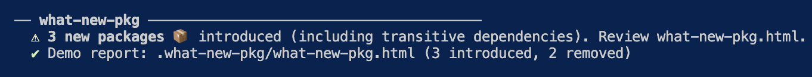
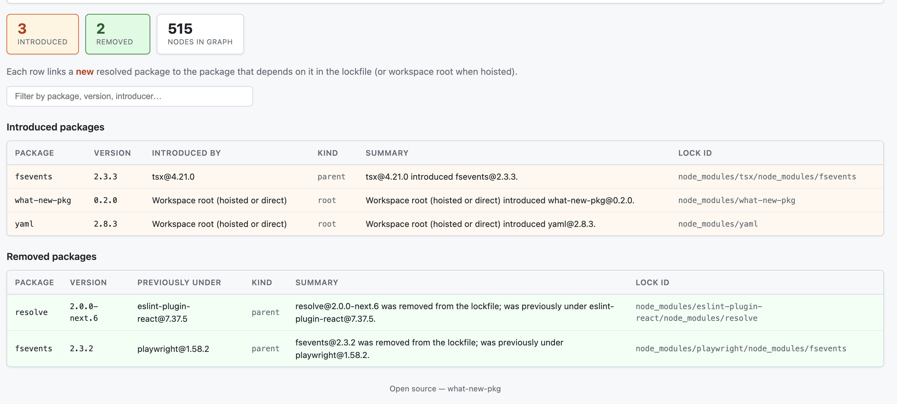

# what-new-pkg

**See whether any unwanted or suspicious new packages slipped into your project unnoticed** after an install—and **who introduced them**—with a terminal summary and an HTML report.

Open-source CLI for **npm** and **pnpm**: it diffs the **current** lockfile against the same file at **git `HEAD`** and lists each **new** resolved package with its **immediate dependent** (or workspace root when hoisted).

[](https://www.npmjs.com/package/what-new-pkg)
[](https://github.com/mayukh-dsc/what-new-pkg/actions/workflows/ci.yml)
[](https://opensource.org/licenses/MIT)

Releases are published with [npm provenance](https://docs.npmjs.com/generating-provenance-statements) (build-linked attestations on npm).

---

## See what you get

**Terminal** — highlights when new packages show up:



**HTML report** (default: `.what-new-pkg/what-new-pkg.html`) — introduced vs `HEAD` with **Introduced by**; removals with **Previously under**:



- New transitive additions can trigger a **warning**-styled line with a **bold** count; **removals alone** do not trigger that line.

---

## Why?

- **Transitive supply chain:** Compromised or unwanted code often arrives through **dependencies of dependencies**—and can reach **production** builds and runtime. You need to know **what** landed in the lockfile and **which parent** pulled it in.
- **This tool** surfaces that by diffing your lockfile to `git show HEAD:<lockfile>`.

---

## Install

```bash
npm install --save-dev what-new-pkg
```

Optional: add a **postinstall** hook (or run `npx what-new-pkg setup`):

```json
{
  "scripts": {
    "postinstall": "what-new-pkg generate"
  }
}
```

---

## Usage

**Typical** (auto-detects `pnpm-lock.yaml` if present, else `package-lock.json`):

```bash
what-new-pkg generate
```

**More options**

```bash
# Lockfile path (relative to project root)
what-new-pkg generate --lock-file package-lock.json

# Output directory (default: .what-new-pkg)
what-new-pkg generate --output-dir .what-new-pkg

# Sample HTML (dummy diff; no git or real lockfile required)
what-new-pkg demo
```

From this repository’s root, **`npm run generate`** builds and runs `what-new-pkg generate` (same as `npx what-new-pkg generate` after a build). Pass CLI flags after `--`, for example:

```bash
npm run generate -- --lock-file test-packages/package-lock.json
```

**`npm run demo`** builds and writes `.what-new-pkg/what-new-pkg.html` using bundled sample data for a quick browser preview.

### How comparison works

- The baseline is the **committed** lockfile at **`HEAD`** for the **same path**. Commit your lockfile so diffs mean something. If it is missing from `HEAD` or the project is not a git repo, the report explains that and shows no “introduced” rows (no crash). **Large lockfiles** (multi‑MB monorepos) are supported when reading that baseline from git.
- **Monorepos:** run once per **package root** that owns a lockfile (e.g. workspace root with one `pnpm-lock.yaml` or `package-lock.json`).

---

## Configuration

Optional `"what-new-pkg"` section in `package.json`:

```json
{
  "what-new-pkg": {
    "outputDir": ".what-new-pkg"
  }
}
```

---

## Lock file support

| Format                       | Status                      |
| ---------------------------- | --------------------------- |
| `package-lock.json` v1/v2/v3 | Supported                   |
| `pnpm-lock.yaml`             | Supported                   |
| `yarn.lock`                  | Not planned in this release |

---

## Security

This package is published with **npm provenance** (`npm publish --provenance`), linking each release to its GitHub Actions build. Verify versions on [npm](https://www.npmjs.com/package/what-new-pkg).

To report a vulnerability in `what-new-pkg` itself, see [SECURITY.md](./SECURITY.md).

---

## Contributing

Contributions are welcome! See [CONTRIBUTING.md](./CONTRIBUTING.md).

The `test-packages/` directory holds **generated** large mock lockfiles (`pnpm-lock.yaml`, `package-lock.json`, `yarn.lock`) for stress testing or local experiments.

**Regenerate from scratch** (each file is rebuilt; must stay above 5000 lines):

```bash
npm run generate:test-packages
```

**Simulate a small dependency change** (removes the lowest-index `mock-dep-*`, adds two new `mock-dep-*` after the current max—run per format or all):

```bash
npm run mutate:test-packages:pnpm
npm run mutate:test-packages:npm
npm run mutate:test-packages:yarn
npm run mutate:test-packages
```

---

## Releasing

Maintainers: automated npm and GitHub Releases from git tags — see [RELEASING.md](./RELEASING.md).

---

## License

[MIT](./LICENSE)
